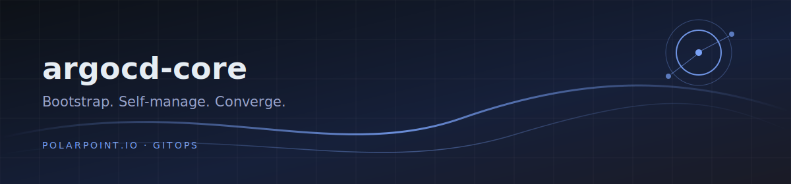

# argocd-core

Bootstrap chart for ArgoCD — multi-source Applications, per-environment
values, self-managing configuration.

Deploys three Applications into the `argocd-config` project:

| Application        | What it manages                                            |
|--------------------|------------------------------------------------------------|
| argocd-config      | this repo itself (self-management of the bootstrap)        |
| argocd             | ArgoCD via the public argo-helm chart + env values         |
| argocd-app-of-apps | [argocd-app-of-apps](https://github.com/polarpoint-io/argocd-app-of-apps): projects, clusters, repos, parent applications |

## Bootstrap (once per cluster)

```
helm template . -f non-prod-core-values.yaml | kubectl apply -n argocd -f -
```

Order on a fresh cluster: install ArgoCD minimally (via
[ansible-rke2-installer](https://github.com/polarpoint-io/ansible-rke2-installer)),
apply this chart, then ArgoCD adopts itself via the `argocd` Application.
The `argocd-config` AppProject is created by the app-of-apps chart; the
first sync of argocd-app-of-apps may need a manual retry before the
project exists.

## Per-environment files

- `<env>-core-values.yaml` — environment name + chart revisions
- `<env>-aoa-values.yaml` — projects, clusters, repositories, parent apps
- `<env>-argocd-values.yaml` — argo-cd chart values (ingress, RBAC, OIDC)

## Topology

Hub/spoke: the controller cluster runs ArgoCD and manages workloads on
all clusters. Downstream clusters are registered declaratively in
`<env>-aoa-values.yaml` (`clusters:`), with bearer-token credentials
delivered by external-secrets from the hub's `cluster-secrets-store`.

The ArgoCD UI is exposed over Tailscale (operator ingress, device
`deploy`).
