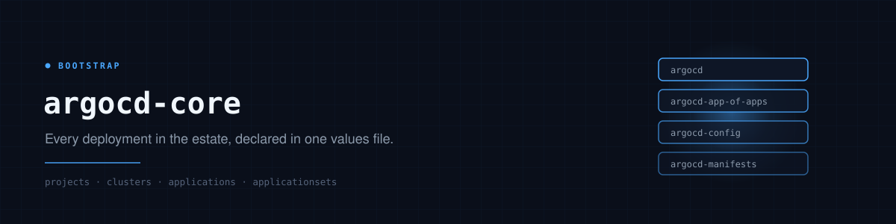

# argocd-core

Bootstrap chart for ArgoCD, and the single place every deployment in the estate
is declared.

Two things live here. The templates bootstrap ArgoCD itself; the
`<env>-aoa-values.yaml` files describe every application and ApplicationSet the
estate runs. Nothing else declares a deployment — there are no per-app descriptor
files and no parent Applications.

## Layout

```
argocd-core/
├── templates/                  the four Applications that bootstrap ArgoCD
│   ├── argocd.yaml               ArgoCD itself, from the argo-helm chart
│   ├── argocd-core.yaml          this repo, so the bootstrap self-manages
│   ├── argocd-app-of-apps.yaml   the chart that renders everything below
│   └── argocd-applicationsets.yaml
├── non-prod-core-values.yaml     chart versions: ArgoCD and app-of-apps
├── non-prod-argocd-values.yaml   values passed to the argo-helm chart
└── non-prod-aoa-values.yaml      EVERY application and ApplicationSet
```

## The environment values file

`non-prod-aoa-values.yaml` is the file that matters. It carries the projects,
their permissions and destinations, the clusters, the credentials templates, and
under each project either `applications:` or `applicationSets:`.

**`applications:`** — one entry per deployment, for anything that runs on a
single cluster.

```yaml
- name: kargo-non-prod
  url: ghcr.io/akuity/kargo-charts
  chart: kargo
  targetRevision: 1.11.0
  namespace: kargo
  labels: {service: controller}
  values: |
    api:
      host: promote.polarpoint.io
  extraSources:              # its ExternalSecrets and Certificate
    - url: git@github.com:polarpoint-io/helm-library-manifests.git
      path: .
      targetRevision: v2.2.0
      values: |
        global:
          syncWave: "-1"     # land before the workload that mounts them
        externalSecrets: [...]
```

**`applicationSets:`** — for the foundational baseline, fanned across every
cluster in the project's `clusters:` list. One entry installs a component
everywhere; adding a cluster installs the whole baseline on it.

```yaml
clusters:
  - {name: non-prod,             short: controller,  server: https://kubernetes.default.svc}
  - {name: non-prod-tooling,     short: tooling,     server: https://192.168.11.80:6443}
  - {name: non-prod-multitenant, short: multitenant, server: https://192.168.11.63:6443}

applicationSets:
  - name: cert-manager
    url: https://charts.jetstack.io
    chart: cert-manager
    targetRevision: v1.21.1
    namespace: cert-manager
```

Anything that varies only by cluster stays inline, where the generator can
substitute it — `{{cluster}}`, `{{short}}`, `{{server}}`, or any other key on a
cluster entry. A values file fetched from git gets no substitution, so a
per-cluster value must not live there.

## Where values live

Small values stay inline. An upstream chart's configuration goes in a file under
[argocd-applications](https://github.com/polarpoint-io/argocd-applications) and
is referenced with `valuesPath`, which makes the Application multi-source: the
chart, plus that repo as a `$values` reference.

```yaml
- name: falco
  url: https://falcosecurity.github.io/charts
  chart: falco
  targetRevision: 9.1.0
  namespace: falco
  valuesPath: foundational/security/falco/non-prod/values.yaml
```

The `<env>/` folder in that path is what lets prod differ from non-prod without a
second chart.

## Bootstrap (once per cluster)

```sh
helm template . -f non-prod-core-values.yaml | kubectl apply -n argocd -f -
```

From then on ArgoCD manages itself: `argocd-config` syncs this repo, `argocd`
syncs the argo-helm chart at the pinned `argocd_chart_revision`, and
`argocd-app-of-apps` renders everything declared in the environment values.

## Rendering locally

```sh
helm template core . -f non-prod-core-values.yaml
helm template aoa ../argocd-app-of-apps -f non-prod-aoa-values.yaml
```

The second is the one to check before pushing — it produces every Application
and ApplicationSet the estate will have.

## The stack

| Repo | Owns |
|---|---|
| [`argocd-core`](https://github.com/polarpoint-io/argocd-core) | ArgoCD bootstrap, and every deployment declaration |
| [`argocd-app-of-apps`](https://github.com/polarpoint-io/argocd-app-of-apps) | The chart that turns those declarations into Applications |
| [`argocd-applications`](https://github.com/polarpoint-io/argocd-applications) | Charts and values files the declarations point at |
| [`helm-library-manifests`](https://github.com/polarpoint-io/helm-library-manifests) | The manifests every application repeats |
